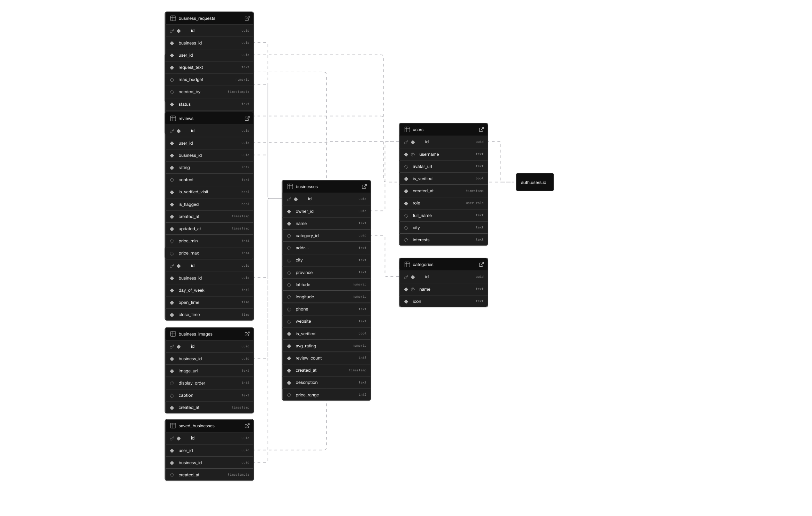

 
   
  
	
	
	 
	 

<h1>Neighbr</h1>
<h3>A mobile platform designed to strengthen local economies by directly connecting community members with small businesses in a more dynamic and meaningful way</h3>

 
 

# Features

## User Authentication

- Email/password registration with email verification flow
- Anonymous (guest) browsing mode
- Password reset via email
- Secure session storage using OS keychain (Keychain on iOS, EncryptedSharedPreferences on Android)
- PKCE auth flow via Supabase

## Onboarding

- Multi-step onboarding wizard (profile setup → location permissions → interest selection)
- Avatar upload from camera or photo library
- Username validation with profanity filtering
- Skippable steps with "skip all" option

## Business Discovery

- Home feed with featured (top-rated, verified) and newest businesses
- Full browse screen with infinite scroll pagination
- Real-time search by name, city, or keyword with debounce
- Filter by one or more categories simultaneously
- Sort by top rated, newest, most reviewed, or name A–Z
- Category icon mapping system

## Business Details

- Business profile page with hero image, rating, price range, and category
- Weekly business hours display
- Contact info (phone, website)
- Save/bookmark businesses
- Verified business badge

## Reviews & Requests

- Write star ratings with optional written reviews
- Review guidelines and duplicate review prevention
- Guest users blocked from submitting reviews/requests
- Post service requests with optional budget and deadline
- Track personal request status (open → claimed → completed)

## Profile

- View and edit profile (username, display name, city, avatar, interests)
- Interest tags displayed on profile
- Owner vs. Member role badge
- My Reviews screen with review deletion
- My Requests screen with business link
- Saved Places screen with undo-unsave support
- Notification preference toggles (persisted to user metadata)
- Account deletion via Supabase RPC

## Owner Portal

- Owner dashboard with listing count, total reviews, and open request summary
- Create and edit business listings (name, description, category, location, contact, price range)
- Set business hours per day with open/closed toggle and time picker
- Per-business analytics tab (avg rating, review count, rating breakdown bar chart)
- Reviews tab for reading customer reviews
- Requests tab with open/in-progress/done kanban-style sections
- Claim and mark-done actions on customer requests
- Badge on listings showing open request count

## Technical

- GoRouter with auth-aware redirect guards
- Bottom navigation shell with three tabs (Explore, Browse, Profile)
- Material 3 design with full light/dark theme support
- Supabase backend with Row Level Security
- Repository pattern separating data access from UI

# Database Schema

