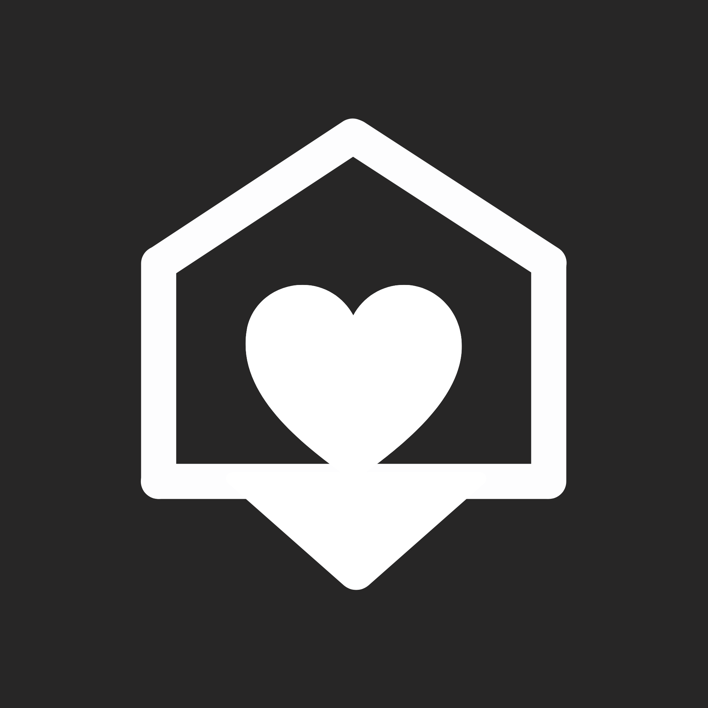

 
   
  
	
	
	 
	 

<h1>Neighbr</h1>
<h3>A mobile platform designed to strengthen local economies by directly connecting community members with small businesses in a more dynamic and meaningful way</h3>

 
 

# Features

- Secure authentication system
- Dual-role architecture
- Incredibly scalable backend
- Structured business discovery interface
- Request-based local marketplace model

 
 
